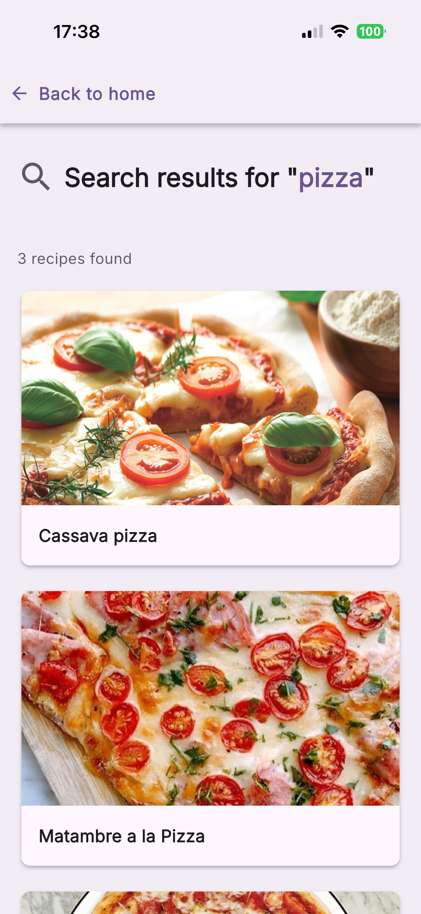
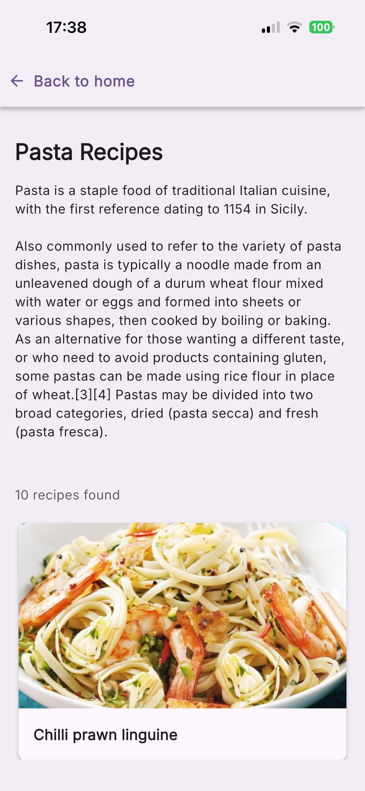

#  Recipe Finder

A Flutter application for discovering and exploring recipes from TheMealDB API. The app provides an intuitive interface to browse recipes by category, search for specific dishes, view detailed recipe information including ingredients, instructions, and video tutorials.

## Features

### List Categories
Browse recipes organized by categories such as Beef, Chicken, Dessert, and more. Categories are displayed in a grid layout with visual cards for easy navigation.

### List Suggestions
Get recipe suggestions on the home screen. These featured recipes help users discover new dishes and trending recipes.

### List Recipes by Category
View all recipes within a specific category. Each category page displays a curated list of recipes with images and basic information.

### Search Recipes
Search for recipes by name using the search bar on the home screen. Get instant results matching your search query with real-time filtering.

### Show Recipe Details
View comprehensive recipe information including:
- High-quality recipe images
- Complete list of ingredients with measurements
- Step-by-step cooking instructions
- Embedded video tutorials (when available)
- Recipe metadata (category, area/cuisine, difficulty level, tags)

### Internationalization (i18n)
The app supports multiple languages including English and Portuguese (Brazilian), automatically detecting the device locale.

## Architecture

The application follows **Clean Architecture** principles with a clear separation of concerns across three main layers:

### Domain Layer (`lib/src/domain/`)
Contains the core business logic and entities:
- **Entities**: Pure Dart classes representing domain models (Recipe, Category, Ingredient)
- **Repositories**: Abstract interfaces defining data operations
- **Use Cases**: Business logic operations (e.g., FetchRecipeSuggestions)
- **Failures**: Custom error types for domain-level exceptions

### Data Layer (`lib/src/data/`)
Handles data sources and implements domain interfaces:
- **Data Sources**: Remote data source implementations for API calls
- **Models**: Data transfer objects (DTOs) with JSON serialization
- **Repository Implementations**: Concrete implementations of domain repositories
- **Exception Handling**: HTTP exception handling mixins for error management

### Presentation Layer (`lib/src/presentation/`)
UI components and state management:
- **Views/Screens**: Flutter widgets for each screen (Home, Recipe Details, Search, Category)
- **Widgets**: Reusable UI components (RecipeCard, SearchBar, VideoPlayer, etc.)
- **Navigation**: GoRouter configuration for declarative routing
- **Theme**: App theme configuration
- **i18n**: Internationalization support using slang package

### Infrastructure (`lib/src/infra/`)
Shared infrastructure components:
- **Logger**: Custom logging implementation
- **Constants**: Application configuration and API endpoints

### Key Technologies

- **State Management**: Provider + ChangeNotifier
- **Navigation**: GoRouter
- **HTTP Client**: http package
- **Internationalization**: slang
- **Code Generation**: Freezed, Json Serializable, Slang
- **Architecture Pattern**: Clean Architecture with MVVM

## How to Run the Project

### Prerequisites

- Flutter SDK (>=3.38.6 <4.0.0)
- Dart SDK (^3.10.7)

### Setup

1. **Clone the repository**
   ```bash
   git clone https://github.com/emersonsiega/flutter_recipes_app.git
   cd flutter_recipes_app
   ```

2. **Install dependencies**
   ```bash
   flutter pub get
   ```

3. **Generate code**
   
   The project uses code generation for models, freezed classes, and i18n files. Run:
   ```bash
   dart run build_runner build -d
   dart run slang
   ```

   Or for continuous watch mode:
   ```bash
   dart run build_runner watch -d
   dart run slang watch
   ```

4. **Run the app**

   For mobile devices:
   ```bash
   flutter run
   ```

5. **Run tests**
   ```bash
   flutter test
   ```

### Configuration

The app currently uses TheMealDB API. The API configuration is set in `lib/src/config/constants.dart`. For production use, consider moving these values to environment variables or a configuration file.

**Note**: Currently, the API key is hardcoded. For production deployments, ensure sensitive information is managed through environment variables or secure configuration management.

## Screenshots & Demo

Screenshots and GIFs will be added here to showcase:
- Home screen with categories and suggestions  
<br/> 
  

- Recipe search view  
<br/>
    

- Recipe details view  
<br/>
     

- Category browsing experience  
<br/>
      

- Screen recordings

#### Search screen and recipe details
[Demo](https://github.com/user-attachments/assets/1d9d62b9-941d-4e60-ab8b-f1a916f8e42e)

#### Home screen and category browsing
[Demo](https://github.com/user-attachments/assets/7056a72c-2033-4ed0-979a-c384fff71d6b)


## Future Work

The following features are planned for future releases:

- [ ] Add custom layout for Web/Desktop platforms
- [ ] Save/list favorite recipes
- [ ] Add rating mechanism for recipes
- [ ] Publish the Web version
